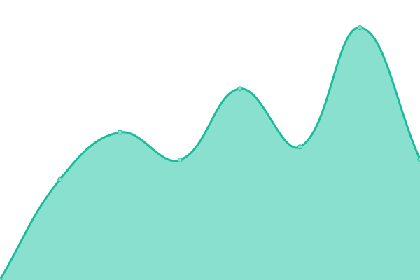
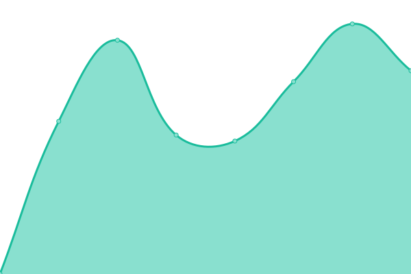

# [📈 Live Status](https://kliq-studio.github.io/monitoring): <!--live status--> **🟧 Partial outage**

This repository contains the open-source uptime monitor and status page for [KLIQ Studio](https://kliq.studio), powered by [Upptime](https://github.com/upptime/upptime).

With [Upptime](https://upptime.js.org), you can get your own unlimited and free uptime monitor and status page, powered entirely by a GitHub repository. We use [Issues](https://github.com/kliq-studio/monitoring/issues) as incident reports, [Actions](https://github.com/kliq-studio/monitoring/actions) as uptime monitors, and [Pages](https://kliq-studio.github.io/monitoring) for the status page.

<!--start: status pages-->
<!-- This summary is generated by Upptime (https://github.com/upptime/upptime) -->
<!-- Do not edit this manually, your changes will be overwritten -->
<!-- prettier-ignore -->
| URL | Status | History | Response Time | Uptime |
| --- | ------ | ------- | ------------- | ------ |
|  [Sellzone](https://sellzone.fr) | 🟩 Up | [sellzone.yml](https://github.com/kliq-studio/monitoring/commits/HEAD/history/sellzone.yml) | 

 863ms
     
 | 

<a href="https://kliq-studio.github.io/monitoring/history/sellzone">100.00%</a>
    

|  [KLIQ Studio](https://kliq.studio) | 🟩 Up | [kliq-studio.yml](https://github.com/kliq-studio/monitoring/commits/HEAD/history/kliq-studio.yml) | 

 1190ms
     
 | 

<a href="https://kliq-studio.github.io/monitoring/history/kliq-studio">100.00%</a>
    

|  [ALP](https://alp-sa.fr) | 🟩 Up | [alp.yml](https://github.com/kliq-studio/monitoring/commits/HEAD/history/alp.yml) | 

 729ms
     
 | 

<a href="https://kliq-studio.github.io/monitoring/history/alp">100.00%</a>
    

|  [Drima Grill](https://drimagrill.fr) | 🟩 Up | [drima-grill.yml](https://github.com/kliq-studio/monitoring/commits/HEAD/history/drima-grill.yml) | 

 743ms
     
 | 

<a href="https://kliq-studio.github.io/monitoring/history/drima-grill">100.00%</a>
    

|  [Smart Quality](https://smartquality.fr) | 🟩 Up | [smart-quality.yml](https://github.com/kliq-studio/monitoring/commits/HEAD/history/smart-quality.yml) | 

 651ms
     
 | 

<a href="https://kliq-studio.github.io/monitoring/history/smart-quality">100.00%</a>
    

|  [La Fabrique des Formats](https://lafabriquedesformats.fr) | 🟥 Down | [la-fabrique-des-formats.yml](https://github.com/kliq-studio/monitoring/commits/HEAD/history/la-fabrique-des-formats.yml) | 

 994ms
     
 | 

<a href="https://kliq-studio.github.io/monitoring/history/la-fabrique-des-formats">94.95%</a>
    

|  [Wattiaux](https://wattiaux.be) | 🟩 Up | [wattiaux.yml](https://github.com/kliq-studio/monitoring/commits/HEAD/history/wattiaux.yml) | 

 1812ms
     
 | 

<a href="https://kliq-studio.github.io/monitoring/history/wattiaux">100.00%</a>
    

|  [Juliette Cadot](https://juliettecadot.com) | 🟩 Up | [juliette-cadot.yml](https://github.com/kliq-studio/monitoring/commits/HEAD/history/juliette-cadot.yml) | 

 728ms
     
 | 

<a href="https://kliq-studio.github.io/monitoring/history/juliette-cadot">85.09%</a>
    

|  [Innowant](https://innowant.fr) | 🟥 Down | [innowant.yml](https://github.com/kliq-studio/monitoring/commits/HEAD/history/innowant.yml) | 

 1001ms
     
 | 

<a href="https://kliq-studio.github.io/monitoring/history/innowant">100.00%</a>
    

<!--end: status pages-->

[**Visit our status website →**](https://kliq-studio.github.io/monitoring)

## 📄 License

- Powered by: [Upptime](https://github.com/upptime/upptime)
- Code: [MIT](./LICENSE) © [Anand Chowdhary](https://anandchowdhary.com), supported by [Pabio](https://pabio.com)
- Data in the `./history` directory: [Open Database License](https://opendatacommons.org/licenses/odbl/1-0/)
